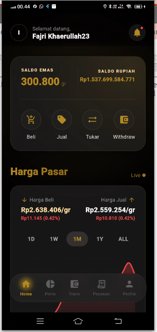
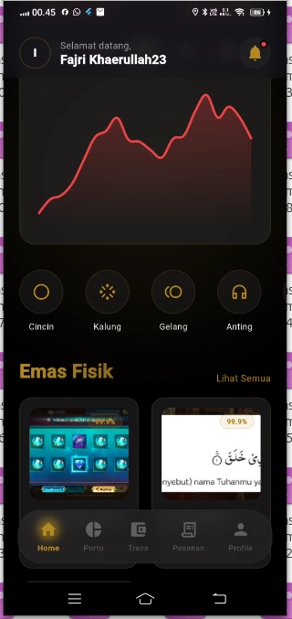
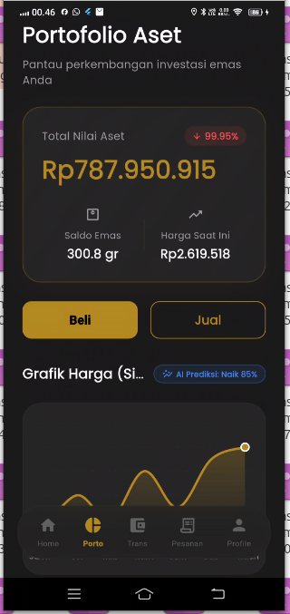
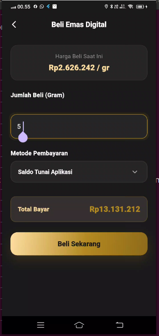
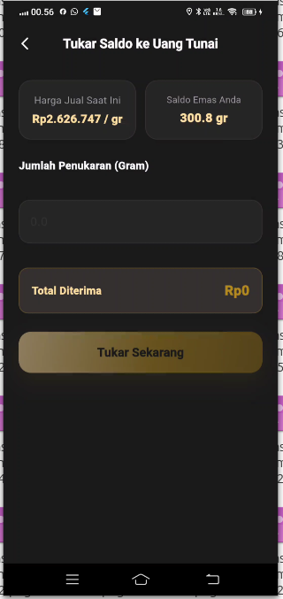
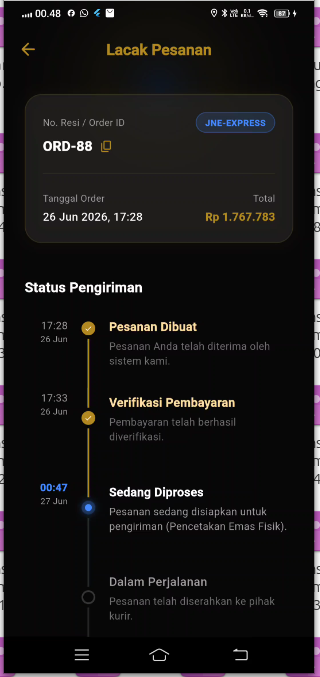
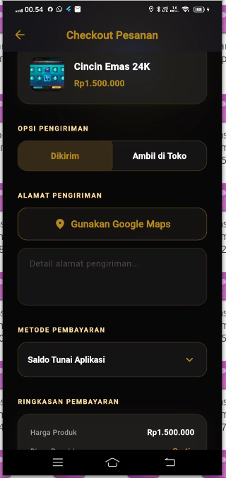
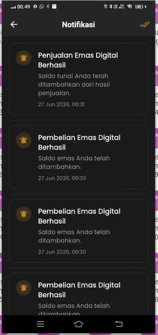
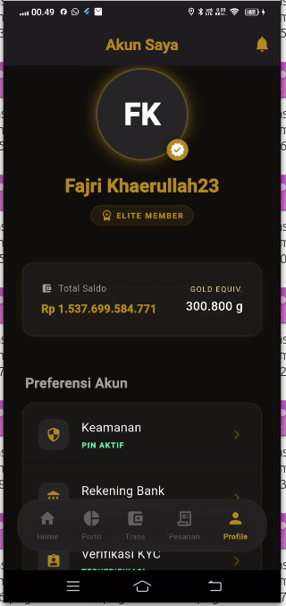

# Toko Emas Digital - Flutter & Go App

Aplikasi toko emas digital premium berbasis **Flutter** untuk Frontend, di-support dengan backend tangguh menggunakan **Golang (Gin + GORM)**, serta integrasi **Firebase Cloud Messaging (FCM)** untuk notifikasi _real-time_.

## 📱 Fitur Utama

### 👤 User Features
- ✅ **Authentication:** Login & Register (Secure token-based via Backend)
- ✅ **Home Screen:** Tampilan harga emas _live_ dengan grafik interaktif
- ✅ **Emas Digital:**
  - Beli/Jual emas digital
  - Lihat saldo emas (gram) dan portofolio rupiah
  - Konversi emas digital ke emas fisik (batangan)
  - Riwayat transaksi detail
- ✅ **Emas Fisik:**
  - Katalog produk premium (cincin, gelang, kalung, anting)
  - Checkout dengan alamat pengiriman & integrasi _Webhook_ (S2S)
- ✅ **Tracking Pesanan:**
  - Status pesanan dengan vertical stepper (Diproses → Dikirim → Selesai)
- ✅ **Push Notifications:**
  - Pemberitahuan otomatis (Heads-Up / Popbar) untuk transaksi berhasil, perubahan status pesanan, dan promo dari admin (FCM + Flutter Local Notifications).

### 🔧 Admin Panel (Premium Redesign)
- ✅ **Dashboard:** Visualisasi metrik total produk, transaksi, dan user
- ✅ **Broadcast Promo:** Kirim notifikasi _push_ seketika ke seluruh perangkat user
- ✅ **CRUD Produk:** Form interaktif untuk menambah, edit, dan menghapus produk (URL/Base64 Image)
- ✅ **Manajemen Kategori:** _Color-coded tiles_ untuk manajemen kategori mudah
- ✅ **Kelola Transaksi:** Pembaruan status transaksi dengan _Visual Status Picker_ (Filter chip: Semua, Pending, Sukses, Dikirim)
- ✅ **Kelola Pengguna:** Pencarian _real-time_, detail KYC, dan blokir/hapus user
- ✅ **Update Harga Emas:** Pembaruan instan dengan opsi harga _preset_ (*Simulator otomatis* / *Manual API*)

## 🛠️ Teknologi & Stack

| Teknologi | Fungsi |
|-----------|--------|
| **Flutter (Dart)** | Mobile Frontend (Android/iOS) |
| **Go (Gin + GORM)**| REST API Backend Server |
| **SQLite / Postgres**| Relational Database |
| **Firebase FCM** | Layanan Push Notification (Broadcast & Transactional) |
| **Provider** | State management (Frontend) |

### 🔄 Riwayat Migrasi (Backend Evolution)
Pada awalnya, aplikasi ini dibangun sepenuhnya secara _Serverless_ menggunakan:
- **Firebase Firestore** sebagai database utama (NoSQL).
- **Supabase Storage** untuk penyimpanan _file_ / gambar produk.

Namun, untuk mencapai skalabilitas level _Production_ dan standar arsitektur industri, sistem dirombak dan bermigrasi sepenuhnya (Full-stack API-Driven):
- Database utama dipindahkan ke **Relational Database (SQLite/PostgreSQL)** agar relasi data (transaksi, produk, user) lebih terstruktur dan aman.
- Penyimpanan gambar di-handle langsung melalui backend via **Base64** atau penyimpanan internal API (menggantikan Supabase Storage).
- **Golang (Gin + GORM)** kini menjadi otak utama (Centralized Backend), sehingga aplikasi Flutter murni bertindak sebagai _Client_ yang berkomunikasi melalui HTTP REST API yang aman.

## 📺 Presentasi Video
🎥 **[Klik di sini untuk menonton presentasi Toko Emas Digital di YouTube](https://youtu.be/SiLeV3ENvA4)**

## 📸 Screenshots UI

Aplikasi ini menggunakan tema desain **Gold Century Pro Max** yang elegan dan modern.

| Home Screen | Katalog Fisik | Portofolio & Chart |
|:---:|:---:|:---:|
|  |  |  |

| Beli Emas | Jual Emas | Lacak Pesanan |
|:---:|:---:|:---:|
|  |  |  |

| Checkout Fisik | Notifikasi | Profil & Saldo |
|:---:|:---:|:---:|
|  |  |  |
## 📂 Struktur Folder (Frontend - Flutter)

```
lib/
├── common/
│   └── widgets/              # Reusable widgets (Buttons, AppBars, dll)
├── core/
│   ├── constants/            # App constants (AppColors: Gold Century Theme)
│   ├── network/              # ApiClient (Dio interceptors)
│   └── services/             # Global services (NotificationService, dll)
├── features/
│   ├── auth/                 # Login & Register
│   ├── admin/                # Layar Admin lengkap (Dashboard, Produk, User, dll)
│   ├── digital_gold/         # Transaksi Emas Digital
│   ├── home/                 # Tampilan Home & Live Price
│   ├── physical_gold/        # Katalog produk emas fisik
│   └── tracking/             # Order tracking
└── main.dart
```

## 🚀 Setup & Installasi

### 1. Clone Repository & Setup Backend

Silakan operasikan Backend Go (`be-tokoemas`)
repo (`https://github.com/Fajri2301/be-tokoemas-golang.git`)
terlebih dahulu. Panduan instalasi dan `.env` lengkap tersedia di folder backend.
Pastikan backend berjalan di URL yang sesuai (misal: `http://192.168.0.x:8080`) dan sinkronkan dengan `ApiClient` di Flutter.

### 2. Setup Frontend Flutter

```bash
git clone https://github.com/Fajri2301/uts_1123150166_tokoemasdigital.git
cd uts_1123150166_tokoemasdigital
```

Install semua dependencies:
```bash
flutter pub get
```

### 3. Setup Firebase Cloud Messaging (FCM)
1. Dapatkan file `google-services.json` dari Firebase Console.
2. Letakkan file tersebut di dalam `android/app/google-services.json`.
3. Pastikan Firebase Authentication juga di-setup jika menggunakannya bersamaan.

### 4. Build & Jalankan Aplikasi

```bash
flutter clean
flutter run
```
*(Catatan: Build pertama kali mungkin memakan waktu karena sistem mendownload package Native Android untuk Local Notifications dan Firebase).*

## 🎨 UI Design (Gold Century - Pro Max Theme)

Aplikasi telah menggunakan sistem desain "Gold Century" yang terlihat mahal, modern, dan profesional.

- **Background (AppColors.bg):** `#1A1A1A` (Hitam Pekat)
- **Surface (AppColors.surface):** `#262626` (Abu-abu Gelap untuk Card)
- **Primary Accent (AppColors.primaryGold):** `#B38922` (Emas Premium)
- **Gradients:** Kombinasi `primaryLightGold` ke `primaryDark` untuk menyorot informasi penting seperti Saldo dan Harga Saat Ini.
- **Interaksi:** Dilengkapi dengan transisi _Bottom Sheet_, animasi _AnimatedContainer_, dan filter navigasi berbasis `Chips`.

## 🔐 Role System

- **User**: Dapat bertransaksi, mengecek histori, dan menerima notifikasi _real-time_.
- **Admin**: Dapat mengakses _Admin Dashboard_ untuk broadcast pesan, kelola pesanan, harga emas, dan produk katalog.

*(Status admin diatur lewat database pada tabel `users` dengan mengubah kolom `role` menjadi "admin").*


## 👥 Developer

**Fajri Khaerullah**
- NIM: 1123150166
- GitHub: [@Fajri2301](https://github.com/Fajri2301)

